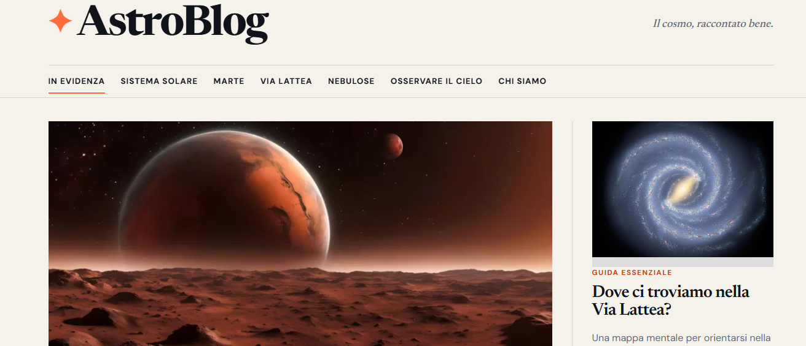

# 🌌 AstroBlog

*Un magazine digitale dedicato alla divulgazione astronomica.*

> **AstroBlog** è un progetto personale sviluppato da **Andrea Bartiromo** con l'obiettivo di rendere l'astronomia accessibile, coinvolgente e scientificamente affidabile attraverso un'esperienza di lettura moderna, intuitiva e ottimizzata per tutti i dispositivi.

---

## 📸 Screenshot

<p align="center">
  
</p>

<p align="center">
  <em>Homepage di AstroBlog</em>
</p>

---

## 📖 Il progetto

AstroBlog nasce dalla volontà di unire due passioni: la comunicazione digitale e l'astronomia. L'idea alla base del progetto è quella di realizzare un magazine online capace di accompagnare il lettore alla scoperta dell'Universo attraverso articoli approfonditi, un linguaggio chiaro e una grafica pulita.

Il sito non è stato concepito come una semplice raccolta di informazioni, ma come un vero e proprio percorso editoriale. Ogni pagina approfondisce un argomento specifico mantenendo uno stile uniforme, una navigazione coerente e una rete di collegamenti che facilita la scoperta di contenuti correlati.

I contenuti sono sviluppati prendendo come riferimento fonti scientifiche autorevoli quali **NASA**, **ESA**, **ASI** e **INAF**, con l'obiettivo di coniugare rigore scientifico e divulgazione.

---

## 🎯 Obiettivi del progetto

AstroBlog è stato sviluppato con l'obiettivo di:

- divulgare l'astronomia attraverso contenuti chiari e accessibili;
- realizzare un sito web moderno, veloce e completamente responsive;
- applicare buone pratiche di sviluppo front-end;
- progettare un'esperienza di navigazione semplice e intuitiva;
- sperimentare un workflow professionale basato su Git e GitHub;
- creare un progetto concreto da inserire nel proprio portfolio personale.

---

## 🌍 Demo online

Sarà disponibile successivamente
---

## 🌠 Contenuti del sito

AstroBlog è ormai vicino alla versione 1.0: il sito comprende un percorso editoriale completo sul Sistema Solare, pagine dedicate all'osservazione del cielo e approfondimenti introduttivi sull'Universo.

La sezione principale è dedicata al **Sistema Solare**, dove ogni corpo celeste dispone di uno speciale editoriale che ne racconta caratteristiche fisiche, origine, struttura, atmosfera, missioni spaziali e curiosità scientifiche.

Attualmente il sito comprende approfondimenti dedicati a:

- ☀️ Sole
- ☿ Mercurio
- ♀ Venere
- 🌍 Terra
- 🌙 Luna
- ♂ Marte
- ♃ Giove
- ♄ Saturno
- ♅ Urano
- ♆ Nettuno
- ☄️ Asteroidi
- ☄️ Comete
- 🪐 Fascia di Kuiper
- 🧊 Nube di Oort

Oltre agli speciali dedicati ai pianeti e ai corpi minori, il sito include sezioni dedicate a:

- 🌌 Via Lattea
- ☁️ Nebulose
- 🔭 Osservare il cielo

Il progetto potrà continuare ad espandersi con ulteriori argomenti dedicati all'esplorazione dell'Universo.

---

## ✨ Caratteristiche principali

AstroBlog è stato progettato prestando particolare attenzione sia all'aspetto editoriale sia a quello tecnico.

Tra le principali caratteristiche del progetto troviamo:

- layout completamente responsive;
- pagine sviluppate con HTML5 semantico;
- fogli di stile CSS3 personalizzati;
- navigazione uniforme tra tutti gli articoli;
- rete di collegamenti interni tra gli approfondimenti;
- ottimizzazione SEO con meta tag, Open Graph e Twitter Card;
- sitemap XML, robots.txt e pagina 404 personalizzata per GitHub Pages;
- immagini ufficiali NASA, ESA e JPL con crediti riportati nelle pagine;
- attenzione all'accessibilità grazie a skip link, struttura semantica e testi alternativi;
- pubblicazione tramite GitHub Pages;
- codice organizzato e facilmente manutenibile.

---

## 🛠 Tecnologie utilizzate

Il progetto è stato sviluppato utilizzando tecnologie web moderne e leggere, senza ricorrere a framework complessi.

Le principali tecnologie impiegate sono:

- HTML5
- CSS3
- Git
- GitHub
- GitHub Pages

Durante lo sviluppo è stato adottato un workflow professionale basato su:

- branch dedicati;
- commit incrementali;
- Pull Request;
- merge manuali;
- controllo delle modifiche prima della pubblicazione.

Questo approccio ha permesso di mantenere il codice ordinato, facilmente revisionabile e stabile durante tutta l'evoluzione del progetto.

---

## 📂 Struttura del progetto

```text
blog-astronomia/
│
├── index.html
├── sistema-solare.html
├── sole.html
├── mercurio.html
├── venere.html
├── terra.html
├── luna.html
├── marte.html
├── giove.html
├── saturno.html
├── urano.html
├── nettuno.html
├── asteroidi.html
├── comete.html
├── fascia-kuiper.html
├── nube-oort.html
├── via-lattea.html
├── nebulose.html
├── osservare-il-cielo.html
├── chi-siamo.html
├── 404.html
├── robots.txt
├── sitemap.xml
├── style.css
├── img/
└── README.md
```

---

## ▶️ Come eseguire il progetto

Essendo un sito web statico, AstroBlog non richiede installazioni particolari né procedure di compilazione.

Per eseguirlo in locale è sufficiente clonare il repository:

```bash
git clone https://github.com/andrea-bartiromo/blog-astronomia.git

cd blog-astronomia
```

Successivamente sarà possibile aprire direttamente `index.html` nel browser oppure utilizzare un server locale, ad esempio tramite l'estensione **Live Server** di Visual Studio Code.

---

## 🎯 Competenze sviluppate

La realizzazione di AstroBlog ha rappresentato un'importante occasione per consolidare competenze sia tecniche sia progettuali.

Attraverso questo progetto sono state approfondite attività quali:

- progettazione dell'architettura di un sito editoriale;
- sviluppo front-end con HTML5 e CSS3;
- realizzazione di layout responsive;
- progettazione dell'esperienza utente;
- ottimizzazione SEO;
- miglioramento dell'accessibilità;
- gestione delle immagini e delle risorse multimediali;
- utilizzo di Git e GitHub secondo un workflow professionale;
- gestione del versionamento attraverso Branch, Pull Request e Merge;
- pubblicazione tramite GitHub Pages.

---

## 🚀 Evoluzioni future

AstroBlog è un progetto in continua evoluzione.

Tra gli sviluppi possibili per le prossime versioni figurano:

- ottimizzazione continua delle immagini e degli asset locali;
- ulteriori miglioramenti dell'accessibilità;
- ricerca interna tra gli articoli;
- modalità scura;
- calendario degli eventi astronomici;
- integrazione con API pubbliche dedicate all'astronomia.

L'obiettivo è trasformare AstroBlog in un punto di riferimento per chi desidera avvicinarsi all'astronomia attraverso contenuti affidabili, aggiornati e facilmente consultabili.

---

## 👤 Autore

**Andrea Bartiromo**

AstroBlog è un progetto personale sviluppato e curato da Andrea Bartiromo con l'obiettivo di coniugare divulgazione scientifica, sviluppo web e comunicazione digitale.

- **GitHub:** https://github.com/andrea-bartiromo
- **Demo online:** https://andrea-bartiromo.github.io/blog-astronomia/
